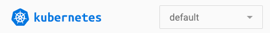
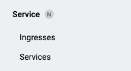
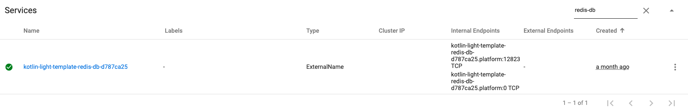

# How to use

This template is based on the [Clean Architecture](https://blog.cleancoder.com/uncle-bob/2012/08/13/the-clean-architecture.html)
proposal. See more details on [Architecture](ARCHITECTURE.md).

# Start

Clone this project repository into your local machine.

Execute the script `service-template-cli.sh`. It will create a personalized version of the project with your own service name. It will
replace the generics names with your preferences.

Move to the new created folder (with the name you gave to the new project).

Create a new GIT project, commit it and push and try the bare project.

# Redis Database
By default, a new redis database will be created for staging and production. In order to use them properly
you'll need to adjust the deployments for both environments. Since version **1.3.0**, the deployment adjustment process was simplified.

## Configuring access to your redis database (>= 1.3.0)
When a new database is created using a `Redis` resource, two new resources are also created automatically: (1) `Service` and (2) `Secret`. All the information required to connect to the redis database is stored on the `Secret`. The `Secret`, whose name is equal to the redis database name, has the following information:

- *endpoint*: The full dns name and port for the service. Ex.: `sample-1.testing-redis-operator.svc.cluster.local:10954`
- *serviceName*: The full dns name for the service. Ex.: `sample-1.testing-redis-operator.svc.cluster.local`
- *servicePort*: The service port for user to connect to the DB. Ex.: `10954`
- *password*: The password needed for user to connect to the DB. Ex.: `y+l6c2,rjr`


Let's suppose you create a new redis database named `kotlin-light-template-redis-db-sample-1` then you will get a `Service` and a `Secret` created. Using this information you can update your staging/production deployment to look like as follows:

```yaml
- name: persistence.redis.endpoint
  valueFrom:
    secretKeyRef:
      key: endpoint
      name: kotlin-light-template-redis-db-sample-1
- name: persistence.redis.password
  valueFrom:
    secretKeyRef:
      key: password
      name: kotlin-light-template-redis-db-sample-1
```

## Configuring access to your redis database (< 1.3.0)
When a new database is created using a `Redis` resource, two new resources are also created: a `Service` and a `Secret`. 
You will use the `Service` name as hostname of your redis database. But, you'll also need the port. To retrieve your redis port, go to
`https://kubernetes.${your-namespace}-staging.etermax.com` and select your namespace.



Then go to the services section



Search for `redis-db`, you should be able to see a service prefixed with your service name, in this case is `kotlin-light-template`



From this search you were able to retrieve: your redis-db hostname (the name of the redis db service) and the redis port (in this case is `12823`).
Using this information you can update your staging deployment to look like this

```yaml
- name: persistence.redis.endpoint
  value: 'kotlin-light-template-redis-db-d787ca25:12823'
- name: persistence.redis.password
  valueFrom:
    secretKeyRef:
      key: password
      name: kotlin-light-template-redis-db-d787ca25
```

The `persistence.redis.endpoint` should be updated with `${your-redis-db-service-name}:${redis-port}`. The name of the secret where the redis db 
password is the same as your service.

Once updated your deployment, your service will be able to use the redis database you just created.

Follow the same steps for your production environment, once the first release has been deployed.

# Configuration dependencies checking
We have some Gradle logic which checks and notifies the outdated dependencies in 
the project through Slack (or just print it in console).

> IMPORTANT: To execute this process, you must set JVM to version 8. Otherwise, it might fail.

It makes use of two Gradle tasks:
* **dependencyUpdates**: From [com.github.ben-manes.versions](https://github.com/ben-manes/gradle-versions-plugin) 
  plugin which generates a JSON report with the dependencies' information.
* **notifyDependencyUpdates**: Reads from the generated report, generates a formatted message and sends it to Slack.
  - It also has a `test mode` which just prints the report through console and avoid sending it to a Slack channel.

## How to generate the report
Before notifying the outdated dependencies, we must generate the report:
1. Go to the root path of the project
2. Execute `dependencyUpdates -Drevision=release`
3. It will analyze the installed dependencies and generate a JSON report in `./build/dependencyUpdates` folder.

## How to generate a formatted report
It gets the report previously generated from `./build/dependencyUpdates/report.json`, formats it and notifies in the selected wat.

As said above, we can:
* Send it to a Slack channel through a Webhook
* Print it locally in your console

### Sending the report through Slack
Optionally, add an environment variable:
* Key: `SLACK_URL`
* Value: the Slack corresponding Webhook URL.

To notify the report, execute: `./gradlew notifyDependencyUpdates -Pchannel="[your cannel]"`.

If you haven't set the `SLACK_URL` environment variable, you can add `-PwebhookUrl="[your webhook url]"` to the command.

### Printing the report in console
If you are testing or don't want to send the report to any channel, you can just print it out in your console. To do so, enable the `test mode` by executing `./gradlew notifyDependencyUpdates -PisTest=true`.

This flag makes it to ignore the Slack related-commands you pass as arguments. Hence, prevents it from processing the Slack notification.

# Developing a Use case
A strategy to develop a use is case includes:

* Add a use case class, an Action, for an operation the externals actors can require from
this application. This class goes into the `core/action` package.
* Start writing the tests cases and move implementing the logic:
    * Complete logic in Action
    * Use mocks, or (preferably) in-memory databases for repositories
    * Add in the domain module the domain classes that represent de problem
    * Add an interface for each external service this model requires, typically a repository
to hold those entities.
    * Add a use case class, an Action, for each operation the externals actors can require from
this application
* Add one or more handlers to receive the externals requests. The handler goes into the 
`http/handler` folder. Usually you should use one folder per each version `/v1`, `/v2`.
* Add configuration classes and include a field for each in the `ClientFactory.Config` class.
* Include the configuration defaults in the `config.yaml` resource
